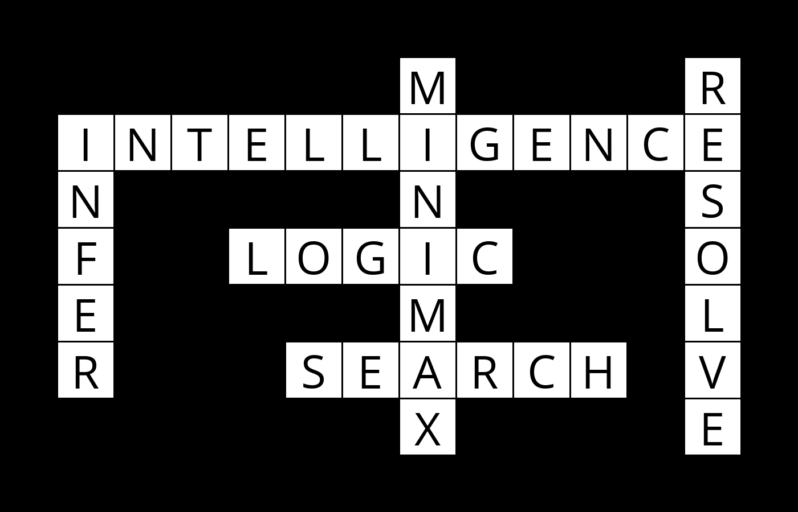

# Crossword Generator

This project involves developing an AI to generate crossword puzzles by solving a constraint satisfaction problem (CSP) using backtracking and constraint propagation algorithms.

### Requirements
Install the `Pillow` package to save images
```bash
$ pip install pillow
```

### Usage
To generate a crossword puzzle, specify the puzzle structure file, words file, and (optionally) the output image file.
```bash
$ python generate.py [structure_file] [words_file] [output_image.png]
```

### Example
```bash
$ python generate.py data/structure1.txt data/words1.txt output.png
██████████████
███████M████R█
█INTELLIGENCE█
█N█████N████S█
█F██LOGIC███O█
█E█████M████L█
█R███SEARCH█V█
███████X████E█
██████████████
```


### Project Overview
This program finds a solution to a crossword puzzle by enforcing constraints on variable assignments:
- Unary Constraints: Words must fit variable lengths.
- Binary Constraints: Overlapping characters between variables must match.
- Unique Values: Each word in the puzzle must be unique.